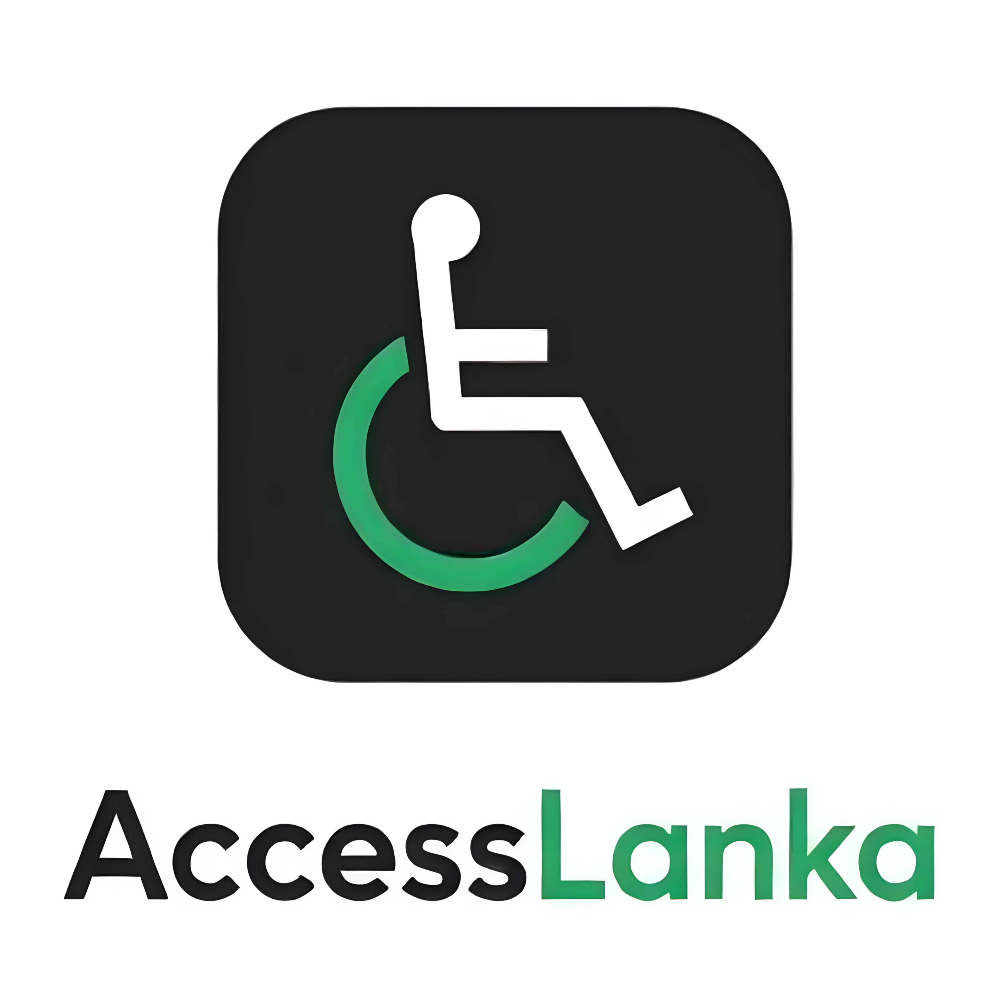

# AccessLanka Mobile App

<div align="center">
  
  
  **An accessibility-focused mobile application for discovering and reviewing accessible places in Sri Lanka**
  
  [](https://expo.dev/)
  [](https://reactnative.dev/)
  [](https://supabase.com/)
</div>

---

## About

**AccessLanka** is a comprehensive mobile application designed to help people with disabilities and accessibility needs discover, review, and share information about accessible places across Sri Lanka. The app empowers users to contribute to a community-driven database of accessibility information, making travel and daily activities more accessible for everyone.

### Mission

To create an inclusive society by providing comprehensive accessibility information about businesses, places, and attractions in Sri Lanka, enabling people with diverse accessibility needs to explore their world with confidence.

---

## Features

### Core Features

- **Explore Places** - Browse and search for accessible businesses, attractions, and places
- **Interactive Maps** - View locations on an interactive map with accessibility indicators
- **Detailed Reviews** - Read and write comprehensive accessibility reviews with category-specific ratings
- **MapMissions** - Participate in community challenges to map accessibility features
- **Business Listings** - Add and manage your own business with accessibility information
- **Favorites** - Save and organize your favorite accessible places
- **Chatbot Assistant** - Get instant answers about accessibility through AI-powered chat
- **Community Posts** - Share experiences and tips with other users

---

## Tech Stack

### Frontend
- **React Native** (0.81.4) - Cross-platform mobile framework
- **Expo** (54.0.13) - Development platform and build system
- **React Navigation** - Navigation library
- **React Native Paper** - Material Design component library
- **TypeScript** - Type-safe JavaScript

### Backend & Services
- **Supabase** - Backend as a Service (PostgreSQL, Auth, Storage)
- **PostgreSQL** - Relational database
- **Supabase Auth** - User authentication
- **Supabase Storage** - File storage

### Key Libraries
- **React Native Maps** - Interactive map integration
- **Async Storage** - Local data persistence
- **React Native Reanimated** - Advanced animations
- **Expo Location** - GPS and location services
- **Expo Image Picker** - Camera and photo gallery access
- **Expo Speech** - Text-to-speech for accessibility
- **React Native Vector Icons** - Icon library

---

## Prerequisites

Before you begin, ensure you have the following installed:

- **Node.js** (v18 or higher) - [Download](https://nodejs.org/)
- **npm** or **yarn** - Package manager
- **Expo CLI** - `npm install -g expo-cli`
- **Git** - Version control
- **iOS Simulator** (Mac only) or **Android Studio** (for Android development)
- **Expo Go App** (for testing on physical devices)
  - [iOS](https://apps.apple.com/app/apple-store/id982107779)
  - [Android](https://play.google.com/store/apps/details?id=host.exp.exponent)

---

## Installation

### 1. Clone the repository
```bash
git clone https://github.com/Ricca20/Accesslanka-Mobile-App.git
cd Accesslanka-Mobile-App
```

### 2. Install dependencies
```bash
npm install
# or
yarn install
```

### 3. Install additional Expo packages
```bash
npx expo install react-dom react-native-web
```

### 4. Set up environment variables

Create a `.env` file in the root directory (optional, defaults are in `src/config/supabase.js`):
```env
EXPO_PUBLIC_SUPABASE_URL=your_supabase_project_url
EXPO_PUBLIC_SUPABASE_ANON_KEY=your_supabase_anon_key
```

### 5. Set up Supabase Database

1. Create a new Supabase project at [supabase.com](https://supabase.com)
2. Copy the SQL schema from `src/lib/dbSchema.txt`
3. Run the schema in the Supabase SQL Editor
4. Configure authentication settings (enable email auth)
5. (Optional) Set up storage buckets for images

---

### Platform-Specific Commands

**iOS Simulator** (Mac only)
```bash
npm run ios
# or
npx expo run:ios
```

**Android Emulator**
```bash
npm run android
# or
npx expo run:android
```

**Physical Device**
1. Install **Expo Go** app on your device
2. Scan the QR code from Expo DevTools
3. The app will load on your device

**Web** (for testing only)
```bash
npm run web
# or
npx expo start --web
```

### Clear Cache
```bash
npx expo start --clear
```

---

## Authors

- **Yasindu Gamage**
- **Nethal Fernando**
- **Ricky Perera**
- **Naduli Weerasinghe**

---

## Acknowledgments

- Expo team for the amazing development platform
- Supabase for the backend infrastructure
- React Native community for excellent libraries
- All contributors who help make this app better
- Users who provide valuable feedback
- Accessibility community for guidance and support

---

## Support

If you encounter any issues or have questions:

- **GitHub Issues**: [Create an issue](https://github.com/Ricca20/Accesslanka-Mobile-App/issues)
- **Discussions**: [GitHub Discussions](https://github.com/Ricca20/Accesslanka-Mobile-App/discussions)

<div align="center">
  
### Made with ❤️ for a more accessible Sri Lanka

</div>
